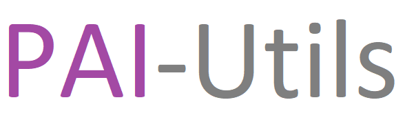

Programming Artificial Intelligence Utilities is a package that aims to make
artificial intelligence and machine learning programming easier through
abstractions of extensive APIs, research paper implementations, and data
manipulation.

Package Features
- Analytics
  - Plotting of data through embedding algorithms, such as Isomap and TSNE
- Audio
  - Recording and playing
  - Volume, speed, and pitch manipulation
  - Trimming and Splitting
  - Spectrogram, Fbanks, and MFCC creation
  - Audio file conversions
- Image
  - Simplified OpenCV Interface
- Autoencoder
  - Trainer and Predictor
  - Trainer with extra decoder
  - VAE Trainer
- Evolution Algorithm
  - One dimensional evolution algorithm
  - Hyperparameter tuner
- GAN
  - GAN Trainer
  - GANI Trainer (GAN which takes provided Inputs)
  - Cycle GAN Trainer
  - Predictors
- Neural Network
  - Trainer and Predictor
  - Dense layers that combine batch norm
  - Convolution layers that combine batch norm, max pooling, upsampling, and transposing
- Reinforcement
  - OpenAI Gym wrapper
  - Multi-agent adverserial environment
  - Greedy, ascetic, and stochastic policies
  - Noise policies
  - Exponential, linear, and constant decay
  - Normal memory and efficient time distributed memory (for stacked states)
  - Agents
    - QAgent: Q-learning with a table
    - DQNAgent Q-learning with a neural network model
    - PGAgent: State to action neural network model (Actor) trained with
               policy gradients
    - DDPGAgent: State to continous action space neural network model trained
                 with deterministic policy gradients
- Reinforcement Agents
  - DQNPGAgent: Combination of a DQN and PG agent into one agent
  - A2CAgent: Advantage Actor Critic agent
  - PPOAgent: Proximal Policy Optimization agent
  - TD3Agent: Twin Delayed DDPG Agent
  - PGCAgent: Continuous variant of PGAgent
  - A2CCAgent: Continuous variant of A2CAgent
